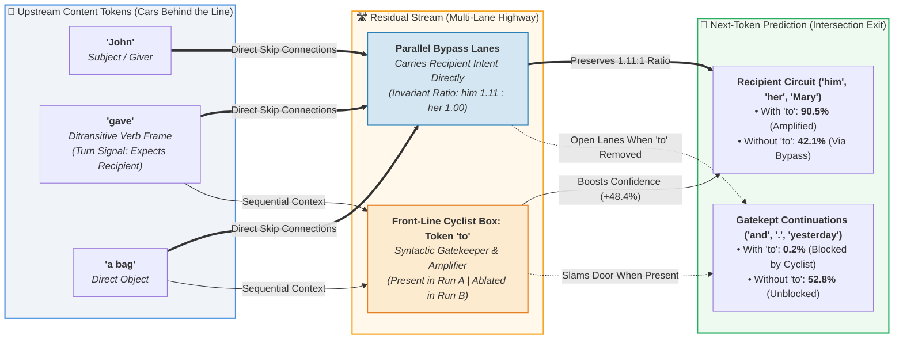

## 🗺️ Visual Architecture: Residual Bypass Lanes & Gatekeeping

```mermaid
flowchart LR
    subgraph Upstream ["🚗 Upstream Content Tokens (Cars Behind the Line)"]
        direction TB
        T1["<b>'John'</b><br/><i>Subject / Giver</i>"]
        T2["<b>'gave'</b><br/><i>Ditransitive Verb Frame<br/>(Turn Signal: Expects Recipient)</i>"]
        T3["<b>'a bag'</b><br/><i>Direct Object</i>"]
    end

    subgraph Residual ["🛣️ Residual Stream (Multi-Lane Highway)"]
        direction TB
        Bypass["<b>Parallel Bypass Lanes</b><br/><i>Carries Recipient Intent Directly<br/>(Invariant Ratio: him 1.11 : her 1.00)</i>"]
        Gate["<b>Front-Line Cyclist Box: Token 'to'</b><br/><i>Syntactic Gatekeeper & Amplifier<br/>(Present in Run A | Ablated in Run B)</i>"]
    end

    subgraph Output ["🚦 Next-Token Prediction (Intersection Exit)"]
        direction TB
        Recip["<b>Recipient Circuit ('him', 'her', 'Mary')</b><br/>• With 'to': <b>90.5%</b> (Amplified)<br/>• Without 'to': <b>42.1%</b> (Via Bypass)"]
        Alt["<b>Gatekept Continuations ('and', '.', 'yesterday')</b><br/>• With 'to': <b>0.2%</b> (Blocked by Cyclist)<br/>• Without 'to': <b>52.8%</b> (Unblocked)"]
    end

    T1 & T2 & T3 ==>|"Direct Skip Connections"| Bypass
    T2 & T3 -->|"Sequential Context"| Gate

    Bypass ==>|"Preserves 1.11:1 Ratio"| Recip
    Gate -->|"Boosts Confidence (+48.4%)"| Recip
    Gate -.->|"Slams Door When Present"| Alt
    Bypass -.->|"Open Lanes When 'to' Removed"| Alt

    style Upstream fill:#f0f4f8,stroke:#4a90e2,stroke-width:2px
    style Residual fill:#fff8eb,stroke:#f5a623,stroke-width:2px
    style Output fill:#eefaf0,stroke:#27ae60,stroke-width:2px
    style Bypass fill:#d4e6f1,stroke:#2980b9,stroke-width:2px
    style Gate fill:#fdebd0,stroke:#e67e22,stroke-width:2px
```
